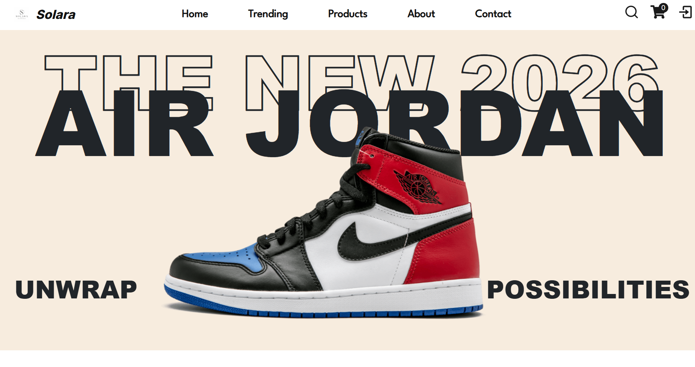

# 🌟 Solara — Premium Shoe E-Commerce Platform

Welcome to **Solara**, a modern full-stack e-commerce platform where style meets performance.
Built using the MERN stack, Solara delivers a clean, responsive, and premium shopping experience with a fully functional admin system and secure payment integration.





## 🚀 Live Demo

👉 https://solara-wine-iota.vercel.app/

---

## 🧠 Project Overview

Solara is a production-ready e-commerce web application designed to simulate a real-world online shopping platform. It includes:

* User authentication & authorization
* Product browsing with filters
* Cart & order management
* Admin dashboard for full control
* Secure Stripe payment integration

The project focuses on **clean UI, smooth UX, and scalable backend architecture**.

---

## ✨ Features

### 🛒 User Features

* Browse products with advanced filtering (category, brand, etc.)
* Search functionality
* Add/remove items from cart
* Secure checkout using Stripe
* View order history
* Responsive design for all devices

---

### 🔐 Authentication

* JWT-based authentication system
* Login & Signup functionality
* Protected routes
* Forgot & Reset password support

---

### 👨‍💼 Admin Panel

* Add, edit, delete products
* Manage categories & brands
* View orders and users
* Dashboard overview

---

### 💳 Payment

* Stripe integration for secure payments
* Payment success flow handling

---

### 📧 Additional Features

* Email notifications (order updates, etc.)
* Clean loading states and optimized UX
* Modern minimal UI (Solara theme)

---

## 🛠️ Tech Stack

### Frontend

* React.js (Vite)
* Axios
* CSS (Custom styling)

### Backend

* Node.js
* Express.js

### Database

* MongoDB (Atlas)

### Authentication

* JWT (JSON Web Tokens)

### Payment

* Stripe API

---

## 📂 Project Structure

```bash
Solara/
├── client/   # Frontend (React)
├── server/   # Backend (Node + Express)
```

---

## ⚙️ Installation & Setup

### 1. Clone Repository

```bash
git clone https://github.com/yogesh-123231/Solara.git
cd Solara
```

---

### 2. Install Dependencies

#### Frontend

```bash
cd client
npm install
```

#### Backend

```bash
cd server
npm install
```

---

### 3. Environment Variables

Create `.env` files in both **client** and **server**

---

#### 📌 Client (.env)

```env
VITE_BACKEND_URL=http://localhost:5000
```

---

#### 📌 Server (.env)

```env
MONGO_URI=your_mongodb_uri
JWT_SECRET=your_secret_key
STRIPE_SECRET_KEY=your_stripe_key
STRIPE_WEBHOOK_SECRET=your_webhook_secret
CLIENT_URL=http://localhost:5173
```

---

### 4. Run the Project

#### Start Backend

```bash
cd server
nodemon index.js
```

#### Start Frontend

```bash
cd client
npm run dev
```

---

## 🧪 Demo Credentials

### 👤 User

* Email: [user@gmail.com](mailto:user@gmail.com)
* Password: password

### 👨‍💼 Admin

* Email: [admin@gmail.com](mailto:admin@gmail.com)
* Password: password

---

## 🎯 Key Highlights

* Fully deployed full-stack application
* Clean and modern UI (Solara branding)
* Real-world features (auth, payments, admin panel)
* Optimized loading experience (handles backend cold starts)

---

## 📌 Future Improvements

* Wishlist functionality
* Product reviews & ratings UI
* Advanced analytics dashboard
* Performance optimization (SSR / caching)

---

## 👨‍💻 Author

**Yogesh Dumane**

---

## ⭐ Final Note

Solara is built as a real-world full-stack project focusing on both **functionality and user experience**.
It demonstrates strong understanding of frontend, backend, and deployment workflows.

If you like this project, feel free to ⭐ the repository!
